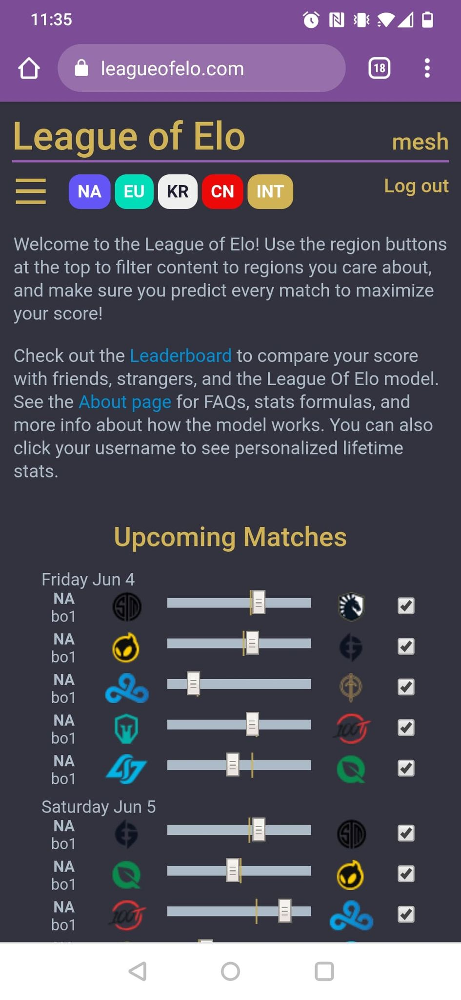
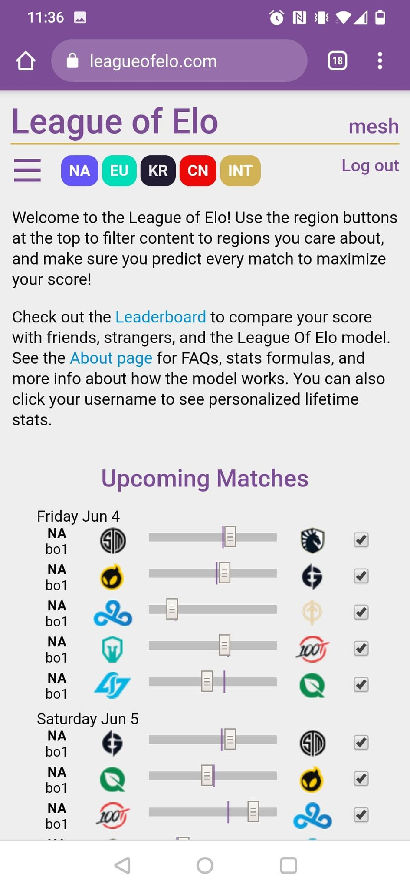
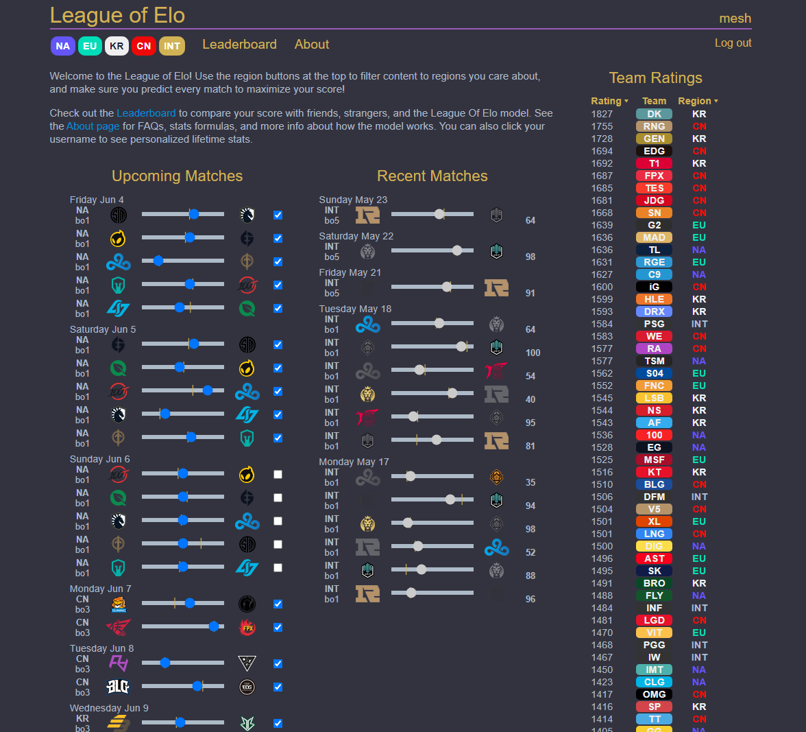
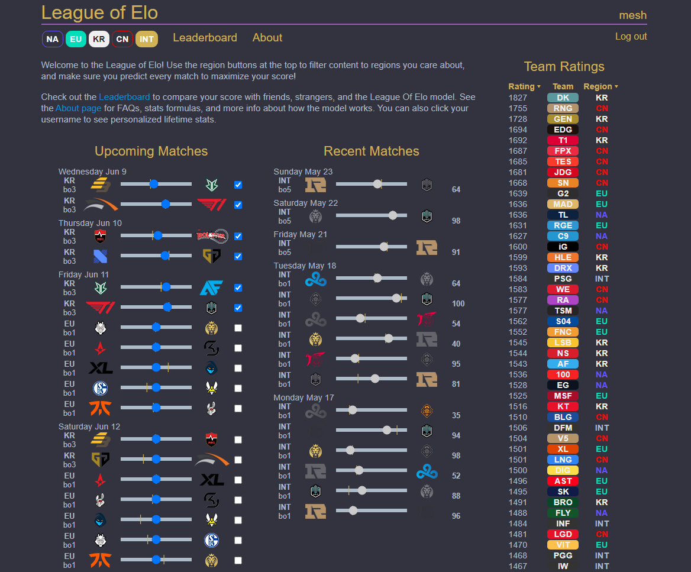

# League Of Elo Django Site

Site is live: https://leagueofelo.com

## Screenshots

### Mobile site dark and light modes



### Desktop site showing region filter



## Setup
```
sudo apt install python3-venv postgresql libpq-dev
python3 -m venv env
source env/bin/activate
python -m pip install django psycopg2 django-colorfield python-decouple mwclient numpy djangorestframework netifaces gunicorn gevent
# Create loe/loe/.env with secret key and postgres passwd
python manage.py collectstatic #needed for colorfield
git submodule init
git submodule update
# Set up leaguepedia login in submodule
python manage.py migrate
python manage.py populate_teams
python manage.py populate_matches
python manage.py createsuperuser # admin user
python manage.py shell # Need to create LeagueOfElo user
python manage.py calculate_elo
```

## Run Server
```
python manage.py runserver
```

## Experimental Docker setup

This application has been containerized using the Dockerfile in the `docker`
directory. While the current container is sufficient to run the server with
a PostgreSQL database, match population and ELO calculation steps are missing
from setup. To try it out, first [install Docker](https://docs.docker.com/get-docker/),
then build the image. All commands are relative to the repo root.

```
$ docker image build -t loe_django docker
```

It may take a few minutes to build the first time, but Docker will cache the
result. Once it completes, you'll have a image named `loe_django` with Django
and PostgreSQL installed, and PostgreSQL configured for Django to connect. To
run the server, run this command. Replace `$PWD` with the current directory if
running on Windows.

```
$ docker container run --rm -p 8000:8000 -v $PWD:/src league
```

After startup completes, you should be able to connect by visiting
[http://127.0.0.1:8000/](http://127.0.0.1:8000/) in a browser. This command
maps port 8000 in the container to port 8000 on the host, mounts the current
directory (containing the source code) as `/src` in the container, and
instructs Docker to automatically remove the container when the container
stops with the `--rm` flag.

Because the source code is volume mounted, you should be able to edit the files
locally in your editor of choice and have the changes be automatically
reflected in the container.